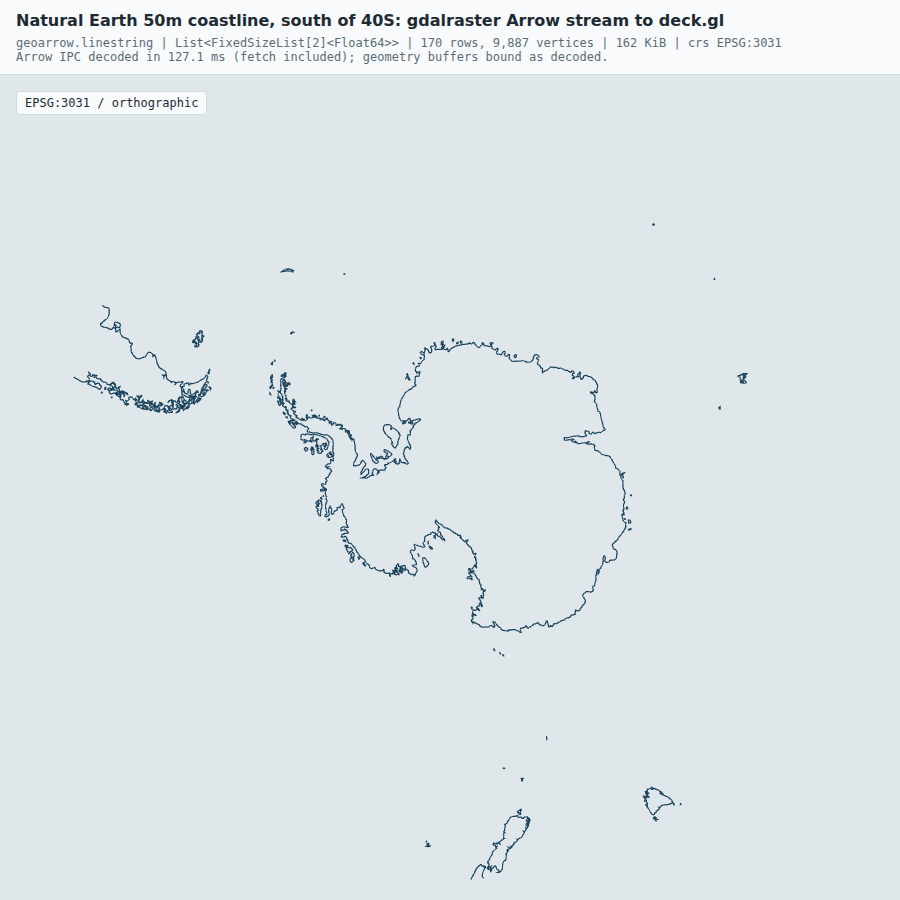

# Spike: gdalraster to native GeoArrow

Issue: [allboa/spikes#2](https://github.com/allboa/spikes/issues/2).
Decision record: `allboa/design` `decisions/0002-gdalraster-geoarrow.md`.

Question: can an OGR layer reach the browser as a native GeoArrow column
(`geoarrow.linestring`, not WKB) through gdalraster's Arrow stream, with GDAL
asked for GeoArrow encoding and no conversion in between?



Dark theme: [screenshot-dark.png](screenshot-dark.png).

## What it showed

Yes, but only when the layer GDAL streams from is itself stored as GeoArrow.

| Route | Source layer | `getArrowStream()` geometry | Conversion |
| --- | --- | --- | --- |
| A | GeoJSON (any non-Arrow driver) | `ogc.wkb`, or `geoarrow.wkb` with `GEOMETRY_METADATA_ENCODING=GEOARROW` | none, but it is WKB |
| B | GDAL Arrow driver, written with `GEOMETRY_ENCODING=GEOARROW_INTERLEAVED` | `geoarrow.linestring`, `List<FixedSizeList<double,2>>` | inside GDAL (ogr2ogr to `/vsimem`) |
| C | GeoJSON, then geoarrow in R | `geoarrow.multilinestring`, interleaved | in R (`as_geoarrow_vctr`) |

- **Route A.** The generic `OGR_L_GetArrowStream()` implementation, used by
  every driver without a native Arrow reader (GeoJSON, Shapefile, GPKG,
  ...), always emits WKB. `GEOMETRY_METADATA_ENCODING=GEOARROW` only changes
  the extension name from `ogc.wkb` to `geoarrow.wkb`. There is no
  `GEOMETRY_ENCODING=GEOARROW` stream option: passing it is silently ignored
  (the only documented value, `GEOMETRY_ENCODING=WKB`, forces WKB on Arrow
  and Parquet layers).
- **Route B.** GDAL does the clip (south of 40S), densify (0.25 degree),
  reproject (EPSG:3031) and GeoArrow encode in one `ogr2ogr()` call to the
  Arrow driver in `/vsimem`. `GDALVector$getArrowStream()` on that dataset
  takes the fast path (`FastGetArrowStream = TRUE`) and hands over the
  native `geoarrow.linestring` column. `nanoarrow::write_nanoarrow()` writes
  the stream straight to Arrow IPC bytes. Nothing in R touches the
  geometry. The browser (apache-arrow 17 + deck.gl 9.1 `PathLayer`,
  `OrthographicView`, `CARTESIAN`) reads the bytes and binds the
  interleaved `Float64Array` as the path attribute: 170 lines, 9,887
  vertices, 162 KiB.
- **Route C.** The WKB stream from route A converts in R with
  `geoarrow::as_geoarrow_vctr(x, schema = geoarrow_multilinestring(coord_type = "INTERLEAVED"))`
  and `write_nanoarrow()` writes native GeoArrow IPC bytes. This is the
  fallback when the source is not Arrow and GDAL should not re-encode it.
  (Route C shows the encoding step only; clip and reproject are not
  repeated.)

Also found:

- The GDAL Arrow driver has four geometry encodings:
  `GEOARROW` (alias `GEOARROW_STRUCT`, separated `x`/`y` children),
  `GEOARROW_INTERLEAVED` (`FixedSizeList<double,2>`, what the probe and
  deck.gl bind directly), `WKB` and `WKT`. Use `GEOARROW_INTERLEAVED`.
- The Arrow and Parquet drivers are not in conda-forge `libgdal-core`; they
  are in the `libgdal-arrow-parquet` plugin package. Without it route B is
  not available and GDAL can only emit WKB.
- CRS placement differs. Route B's stream carries the CRS (WKT2, EPSG:3031)
  only in the schema-level `geo` metadata; the geometry field has
  `ARROW:extension:name` but no `ARROW:extension:metadata`, even with
  `GEOMETRY_METADATA_ENCODING=GEOARROW`. Route A's `geoarrow.wkb` field and
  route C's output carry PROJJSON in `ARROW:extension:metadata`. A consumer
  that looks for the CRS on the field will not find it in route B. The
  scene spec carries the view CRS anyway, so the renderer does not need it.
- nanoarrow and geoarrow in R can write the stream to IPC bytes for the
  browser with no WKB, in both routes B and C.

The browser check is in `web/shot.mjs`: it fails unless the first field
with an extension name is `geoarrow.linestring` with `FixedSizeList[2]`
vertices, then saves the screenshots. Its output for route B:

```
{"rows":170,"column":"geometry","extension":"geoarrow.linestring",
 "fieldExtensionMetadata":null,"storage":"List<FixedSizeList[2]<Float64>>",
 "vertexIsFixedSizeList2":true,"crsFromSchemaGeo":"EPSG:3031",
 "vertices":9887,"rendered":true}
```

## Versions

R 4.5.3, GDAL 3.13.3 (GEOS 3.14.1, PROJ 9.9.0), libarrow 25.0.0,
gdalraster 2.7.0, nanoarrow 0.8.0.1, geoarrow 0.4.4, wk 0.9.5.
Browser side: apache-arrow 17.0.0, deck.gl 9.1.15, esbuild 0.25.10,
Playwright 1.56.1 with its bundled Chromium (SwiftShader WebGL).

## How to run

R, GDAL and the packages come from conda-forge (CRAN was not reachable
from the build machine). With micromamba:

```sh
# micromamba itself: extract bin/micromamba from the conda-forge package
curl -sSL https://conda.anaconda.org/conda-forge/linux-64/micromamba-2.9.0-0.tar.bz2 \
  | tar xj bin/micromamba
./bin/micromamba create -y -p ./env -f environment.yml
./bin/micromamba run -p ./env Rscript spike.R      # writes coast.arrows, coast-c.arrows
```

The R script reads the Natural Earth GeoJSON over `/vsicurl/` from
`raw.githubusercontent.com`, prints what each route's stream contains, and
writes `coast.arrows` (route B) and `coast-c.arrows` (route C). Neither is
committed.

Then the browser page and screenshot (Node 20+):

```sh
cd web
npm install
npm run build            # bundles apache-arrow + deck.gl into bundle.js
npm run shot             # headless Chromium; writes ../screenshot.png and ../screenshot-dark.png
```

`npm run shot` uses Playwright's own Chromium; set `CHROMIUM=/path/to/chrome`
to use another. `web/index.html?src=../coast-c.arrows` fails its check by
design, because route C's column is `geoarrow.multilinestring`.

## Files

- `spike.R`: routes A, B and C, with the checks.
- `environment.yml`: the conda-forge environment.
- `web/main.js`, `web/index.html`: minimal page, modelled on the probe
  template in `allboa/design` (`origin/2026-09-30/probe/template.html`).
- `web/shot.mjs`: static server, browser check and screenshots.
- `screenshot.png`, `screenshot-dark.png`: the result.
